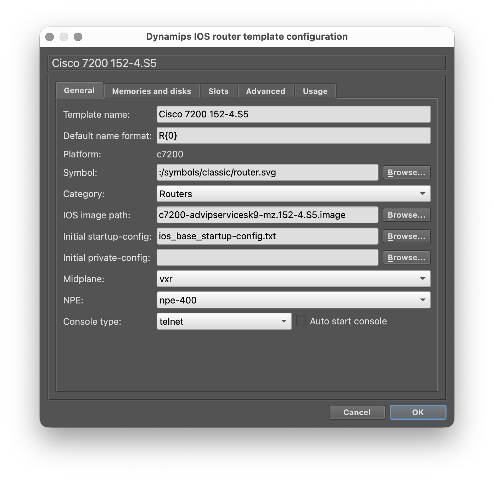
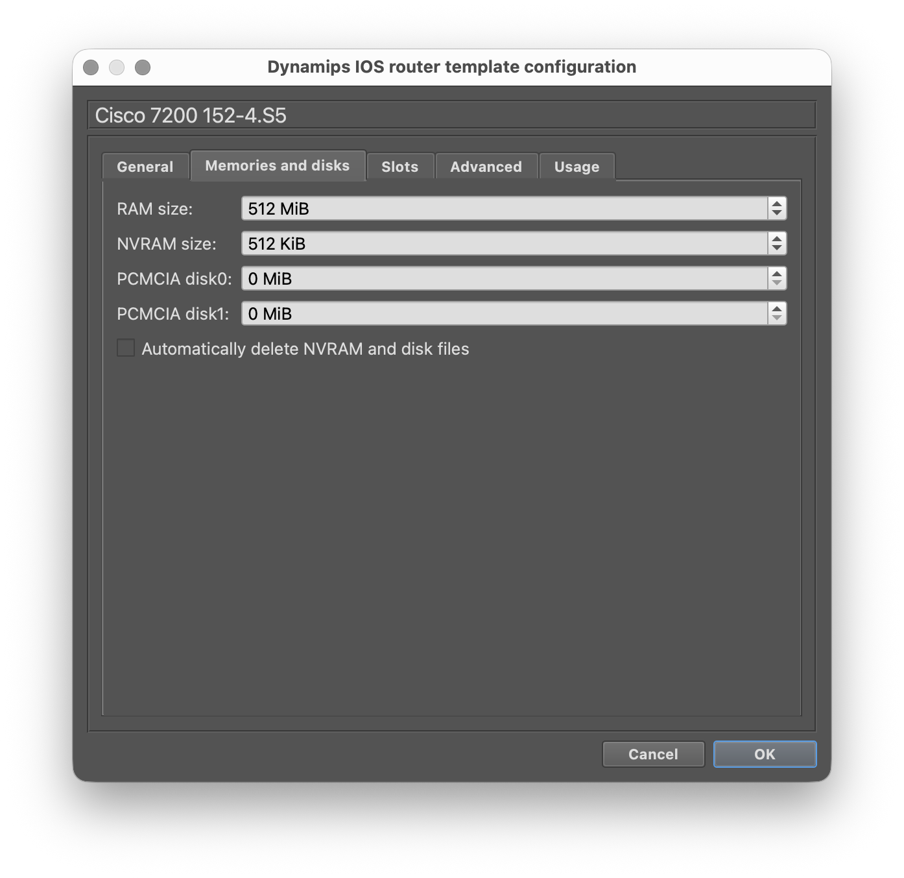
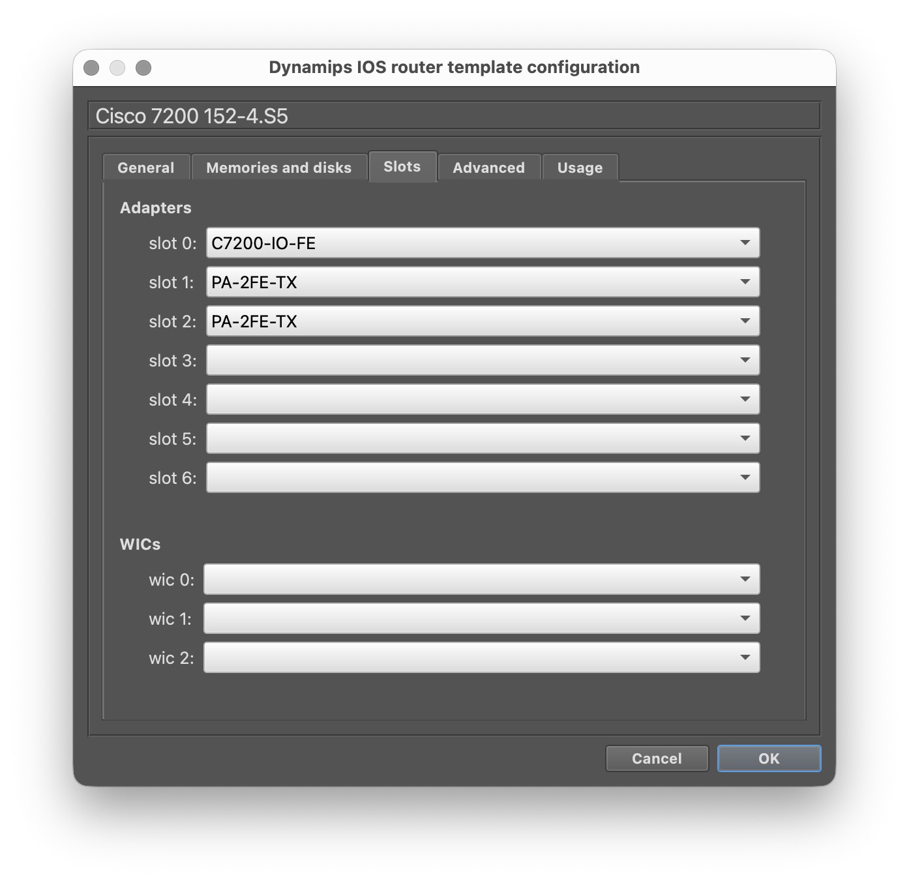

# BGP/MPLS VPN Intent Automation Framework 🚀

[](https://www.gns3.com/)
[](https://www.python.org/)
[](LICENSE)

Welcome to the **BGP/MPLS VPN Automation Framework**. This project is designed to make building a Carrier-Grade Service Provider backbone as simple as running a single command. 

Whether you are a student or a network engineer, this tool automates the complex "under-the-hood" math of MPLS, BGP, and Traffic Engineering so you can focus on the architecture.

---

## ✨ Features at a Glance

*   **One-Click Lab:** Automatically creates your GNS3 topology, wires the nodes, and boots the routers.
*   **Carrier-Grade Core:** Fully automated OSPFv2, MPLS LDP, and VPNv4 iBGP.
*   **Advanced Services:** Support for Shared Internet VRFs and multi-tenant Site Sharing.
*   **Traffic Engineering:** Automated RSVP-TE tunnels with bandwidth reservations.
*   **Smart Manageability:** True declarative management—add or delete prefixes and VRFs with zero "ghost configs."

---

## 🛠️ Step 1: Checklist

To ensure the automation works perfectly, you need the **Cisco 7200** template in GNS3.

1.  **Download:** [Cisco 7200 Appliance](https://gns3.com/marketplace/appliances/cisco-7200)
2.  **Install:** Follow the [GNS3 Tutorial](https://gns3.com/marketplace/appliances/cisco-7200)
3.  **Verify Settings:** Match your template to the figures below:

#### Figure 1: General Settings


#### Figure 2: Memories and Disk


#### Figure 3: Slot Configuration


---

## ⚡ Step 2: One-Minute Setup

We've provided a `Makefile` to handle all the "boring" parts. Just run these commands in your terminal:

### **1. Prepare your machine**
This creates a virtual environment and installs all the Python "brains."
```bash
make setup
```

### **2. Build and Deploy**
Ensure GNS3 is open, then run this to build the entire 8-node network from scratch.
```bash
make build
```

### **3. The Demo**
Once the lab is running, see how the network adapts to changes (Add/Update/Delete) automatically.
```bash
make demo
```

---

## 📐 How it Works (The "Boring" Tech Stuff)

The framework follows a **Model-Driven** approach. You describe *what* you want in a simple YAML file, and the engine handles the *how*.

| Component | Function |
| :--- | :--- |
| **`intent.yaml`** | Your "Order Form." Define your routers, links, and VRFs here. |
| **`automation_lib.py`** | The "Enrichment Engine." Calculates BGP neighbors, labels, and RTs. |
| **`device_config.j2`** | The "Blueprint." A Jinja2 template that writes the Cisco IOS code. |
| **`build_lab.py`** | The "Robot." Talks to GNS3 to build and configure the lab. |

---

## 📂 File Structure

*   `inventory/` - Your network definitions (Single source of truth).
*   `scripts/` - The automation logic and UI/UX code.
*   `templates/` - Cisco IOS configuration blueprints.
*   `output/` - Where the final production-ready configs are saved.

---
**Developed for the 3TC(A) NAS Project.**
MY